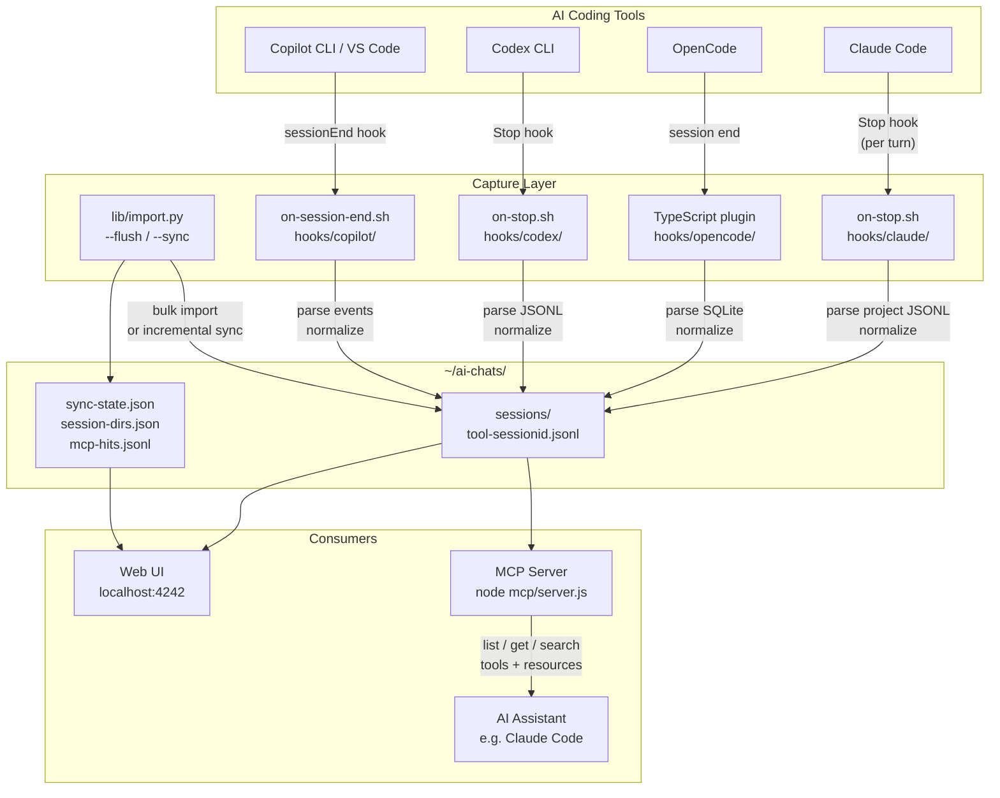
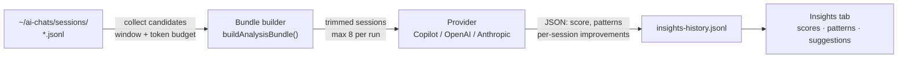
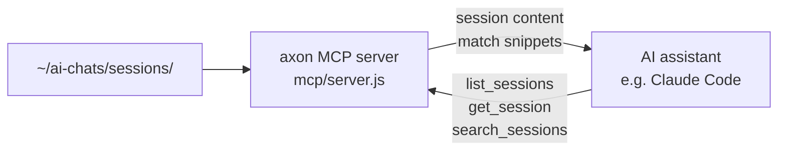

# axon

Captures conversations from Claude Code, OpenAI Codex CLI, GitHub Copilot CLI, and OpenCode into a shared log at `~/ai-chats/sessions/`. Includes a web UI for browsing sessions, token usage stats, and AI-powered prompt quality analysis.

## How it works



## Requirements

- Node.js 22+ (uses `node:sqlite` built-in)
- Python 3.8+
- `jq` (for Claude Code and Codex hooks)

## Quick install

```bash
./install.sh --all
```

This wires up all hooks, does a one-time import of existing sessions, installs the systemd autostart service, and prints instructions for starting the UI.

Use individual flags when you only want part of the setup:

| Flag | What it does |
|------|-------------|
| `--claude` | Wire Claude Code Stop hook |
| `--opencode` | Build and register OpenCode plugin |
| `--codex` | Wire Codex CLI Stop hook |
| `--copilot` | Wire GitHub Copilot CLI sessionEnd hook |
| `--service` | Install and enable systemd autostart service |
| `--ui` | Print UI start instructions |
| `--flush` | One-time full re-import of all existing sessions |
| `--flush=claude` | Re-import one tool only (`claude`, `opencode`, `codex`, `copilot`) |
| `--sync` | Incremental sync — only new or changed sessions |

## Manual hook setup

### Claude Code

Add to `~/.claude/settings.json`:

```json
{
  "hooks": {
    "Stop": [{
      "matcher": "",
      "hooks": [{
        "type": "command",
        "command": "/path/to/axon/hooks/claude/on-stop.sh"
      }]
    }]
  }
}
```

### OpenCode

```bash
cd hooks/opencode/plugin
npm install
npm run build
```

Then add to your OpenCode config (`~/.config/opencode/opencode.json`):

```json
{
  "plugin": ["/path/to/axon/hooks/opencode/plugin"]
}
```

### OpenAI Codex CLI

Replace `INSTALL_DIR` in `hooks/codex/hooks.json` with the actual path, then copy to `~/.codex/hooks.json`.

### GitHub Copilot CLI

Replace `INSTALL_DIR` in `hooks/copilot/session-end.json` with the actual path, then copy to `~/.copilot/hooks/axon.json`.

## Log format

Each session gets its own JSONL file: `~/ai-chats/sessions/<tool>-<session_id>.jsonl`

Every line is one message:

```json
{"ts":"2026-06-12T10:30:00Z","tool":"claude","session":"ses_xxx","role":"user","content":"..."}
{"ts":"2026-06-12T10:30:05Z","tool":"claude","session":"ses_xxx","role":"assistant","content":"..."}
```

The session file is overwritten on each turn (not appended) to avoid duplicates, since Stop hooks fire per turn, not once per session.

## Web UI

Start the server:

```bash
cd ui && node server.js
```

Open `http://localhost:4242`. The UI is token-authenticated — on first start, `AXON_UI_TOKEN` is printed to the terminal. Set it yourself via the env var to fix the token across restarts.

**Tabs:**

- **Sessions** — browse and full-text search all captured conversations; click any session to read the full transcript; inject a past conversation into Claude Code or OpenCode as a new session
- **Stats** — message counts by tool and day, hourly activity heatmap, coding streak tracking, most-active repos
- **Usage** — token counts, costs, and model breakdowns read directly from each tool's native storage
- **Insights** — AI-powered prompt quality scores and suggestions (see [Session Insights](#session-insights) below)
- **MCP** — live feed of MCP tool calls from the MCP server, with per-session and per-tool hit counts

Override the port or bind address:

```bash
PORT=8080 HOST=0.0.0.0 node server.js
```

## Session Insights



Analyses your recent sessions and scores prompt quality (0–10) — how clearly goals and context were stated — with specific suggestions for how each opening message could have been improved.

Requires at least one connected provider:

- **GitHub Copilot** — uses your existing Copilot sign-in (`gh auth login`), no extra key needed
- **OpenAI API** — set `OPENAI_API_KEY`
- **Anthropic API** — set `ANTHROPIC_API_KEY` (or `CLAUDE_API_KEY`)

Run Insights manually from the UI, or enable automatic runs every 6 hours:

```bash
export AXON_INSIGHTS_CRON=1
```

## MCP server



Exposes your captured sessions as queryable tools so AI assistants can search past conversations.

```bash
cd mcp && npm install
node server.js
```

**Tools:**

- `list_sessions` — list sessions, optionally filtered by tool or a search term
- `get_session` — retrieve the full conversation for a specific session ID
- `search_sessions` — full-text search across all conversations, ranked by relevance

**Resources:**

- `session://{tool}/{id}` — a single session as markdown
- `sessions://recent` — the 10 most recent sessions

Add to `~/.claude/settings.json` to use it in Claude Code:

```json
{
  "mcpServers": {
    "axon": {
      "command": "node",
      "args": ["/path/to/axon/mcp/server.js"]
    }
  }
}
```

## Autostart (systemd)

```bash
./install.sh --service
```

Installs a user-level systemd service that starts the UI server at login.

```bash
systemctl --user status axon
systemctl --user restart axon
journalctl --user -u axon -f
```

## Environment reference

| Variable | Default | Description |
|----------|---------|-------------|
| `AI_CHAT_LOG_DIR` | `~/ai-chats` | Root directory for all axon data |
| `PORT` | `4242` | UI server port |
| `HOST` | `127.0.0.1` | UI server bind address |
| `AXON_UI_TOKEN` | random | Auth token for the web UI |
| `AXON_INSIGHTS_CRON` | — | Set to `1` to run Insights automatically every 6 hours |
| `OPENAI_API_KEY` | — | Enables OpenAI as an Insights provider |
| `OPENAI_MODEL` | `gpt-5.5` | OpenAI model for Insights |
| `OPENAI_ORGANIZATION` | — | OpenAI organization ID |
| `OPENAI_PROJECT` | — | OpenAI project ID |
| `ANTHROPIC_API_KEY` | — | Enables Anthropic as an Insights provider (also `CLAUDE_API_KEY`) |
| `ANTHROPIC_MODEL` | `claude-sonnet-4-6` | Anthropic model for Insights |
| `ANTHROPIC_VERSION` | `2023-06-01` | Anthropic API version header |
| `AXON_ALLOW_SENSITIVE_TARGETS` | — | Set to `1` to allow injecting sessions into credential directories (not recommended) |
